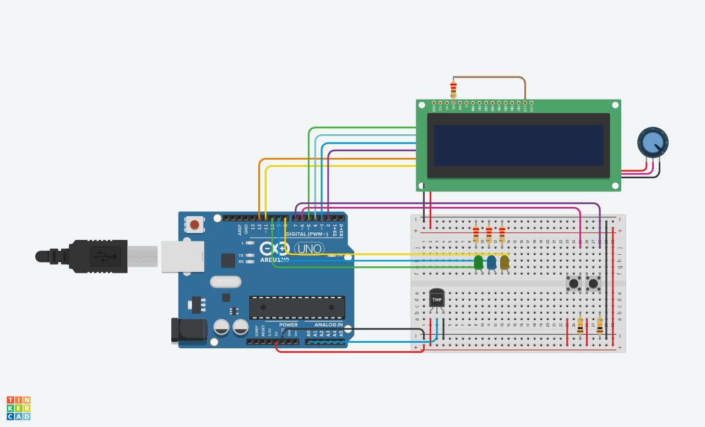

# TemperatureIndicator

TemperatureIndicator é um projeto Arduino que exibe a temperatura em graus Celsius ou Fahrenheit em uma tela LCD. Ele usa um sensor TMP36, dois botões e três LEDs para controlar o sistema. O usuário pode alternar entre as unidades pressionando um botão, e iniciar ou parar o sistema pressionando outro botão.

## Como funciona

O sistema só funciona depois que o botão 1 é pressionado e o LED verde acende. Pressionar o botão 1 novamente interrompe o sistema e apaga o LED verde. Pressionar o botão 2 alterna entre as unidades Celsius e Fahrenheit e acende o LED azul ou amarelo de acordo.

O código usa a biblioteca LiquidCrystal para controlar o display LCD, e define os pinos, variáveis e funções para o sistema. O código também converte a tensão lida do sensor para os valores de temperatura correspondentes.

## Imagens

Esquema do projeto.

Imagem do projeto montado em uma protoboard.

## Licença

Este projeto está licenciado sob a licença MIT. Veja o arquivo [LICENSE](LICENSE) para mais detalhes.